<a name="readme-top"></a>

# OpenSIN Chat

<p align="center">
  <em>Self-hosted AI workspace for political research — chat with documents, search the Bundestag, generate reports.</em>
</p>

<!-- BADGES -->
<p align="center">
  <a href="https://sinchat.delqhi.com">
    
  </a>
  <a href="./LICENSE">
    
  </a>
  <a href="https://github.com/OpenSIN-AI/OpenSIN-Chat">
    
  </a>
</p>

<!-- QUICK LINKS -->
<p align="center">
    <a href="#quick-start">Quick Start</a> |
    <a href="#features">Features</a> |
    <a href="#screenshots">Screenshots</a> |
    <a href="#architecture">Architecture</a> |
    <a href="#deployment">Deployment</a> |
    <a href="#credits">Credits</a>
</p>

<!-- HERO BANNER (custom SVG, dual-mode) -->
<picture>
  <source media="(prefers-color-scheme: dark)" srcset="./assets/hero-banner.svg" />
  <source media="(prefers-color-scheme: light)" srcset="./assets/hero-banner-light.svg" />
  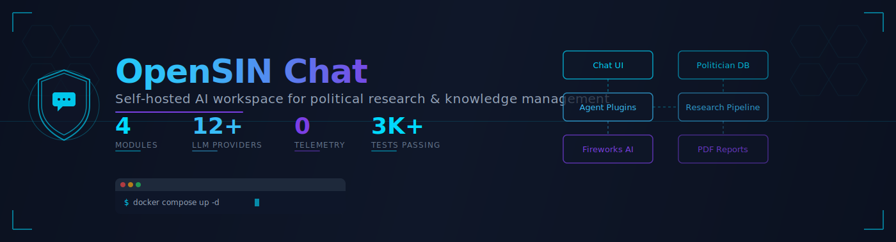
</picture>

---

OpenSIN Chat is a **self-hosted AI platform** for political work, research, and knowledge management. Upload your documents (Bundestag papers, press releases, legislation drafts) and the AI answers questions **only from your sources**, with traceable citations. No hallucinations from thin air, no cloud dependency, zero telemetry.

A sovereign, independent product built by [OpenSIN-AI](https://github.com/OpenSIN-AI) and optimized for the German political sphere. Originally inspired by AnythingLLM, OpenSIN Chat has evolved into a purpose-built system for political research with specialized agents, politician databases, and compliance features.

## Quick Start

```bash
git clone https://github.com/OpenSIN-AI/OpenSIN-Chat.git
cd OpenSIN-Chat/docker-opensin
cp .env.example .env
docker compose up -d
```

The container maps host port `43939` to internal port `3001`. Open `http://localhost:43939` after startup.

> [!IMPORTANT]
> **Node.js 22+ is required** for development and bare-metal builds. The root `package.json` declares `engines.node: ">=22.0.0"`. If you have an older Node version, install Node 22 first (e.g. via `nvm install 22 && nvm use 22`) or use the Docker setup above which bundles the correct runtime.

> [!IMPORTANT]
> Set `FIREWORKS_AI_LLM_BASE_PATH` and `FIREWORKS_AI_LLM_API_KEY` in `.env` to use Fireworks AI as the LLM provider. The SINator Pool Router URL goes in `FIREWORKS_AI_LLM_BASE_PATH`.

> [!NOTE]
> For full setup instructions, environment variables, and bare-metal deployment, see [DEPLOYMENT_GUIDE.md](./DEPLOYMENT_GUIDE.md).

## Features

### Core Features

- **Document Chat** — PDF, DOCX, TXT, Markdown, web pages, YouTube transcripts
- **Vector Databases** — LanceDB, Chroma, Pinecone, Qdrant, Milvus, PGVector
- **LLM Providers** — Fireworks AI (primary, via SINator Pool Router); alternatives: OpenAI, Anthropic, Mistral, DeepSeek, Ollama (local), LM Studio
- **AI Agents** — automated research, web browsing, PDF creation, code execution
- **MCP Compatible** — integrate any external tool via Model Context Protocol
- **Multi-User** — permissions, workspaces, audit logs (Docker edition)
- **Multilingual** — German, English, and more
- **Zero Telemetry** — no PostHog, no CDN tracking, no outbound calls to third parties

### Political Research & OpenSIN-AI Specializations

- **Politician Database** — Bundestag API + Abgeordnetenwatch as structured sources (biographical data, mandates, votes, speeches). Semantic full-text search over plenary protocols via LanceDB vector index
- **Deep Research Pipeline** — automated web research (Search → Extract → Summarize) with source tracking. Async via job IDs, polling-capable
- **OpenSIN PDF Reports** — branded reports (cover, header, footer in OpenSIN blue `#009ee0`) with table of contents, source lists, and politician references — generated directly from research jobs
- **Agent Plugins** — `@politician-search`, `@deep-research`, `@generate-report`, `@orchestrator`, `@pdf-analyze`, `@browser-vision`, `@image-generation`, `@create-files` — callable directly in chat
- **Fireworks AI Vision** — multimodal image analysis via Fireworks AI models (minimax-m3, kimi-k2p5/6/7, qwen-3p7-plus). Upload images and the AI describes what it sees
- **3,000+ Tests** — comprehensive frontend (Vitest) and server (Jest) test coverage

### UI Features

- **ChatGPT-style UI** — centered chat layout (max-w-800px), user message bubbles right-aligned, AI messages left-aligned
- **Dark/Light Mode** — toggle button in sidebar, full theme support with `light:` CSS prefix system
- **Code Blocks** — syntax highlighting with copy button, language label, bg/border styling in both modes
- **Notepad** — inline workspace notes with auto-save, pin, and delete (workspace_notes table)
- **Grounding Badge** — Sparkle icon badge showing when AI uses document sources (RAG)
- **Auto-Summary Cards** — document snippets preview in sidebar
- **Mobile Responsive** — 375px viewport, overlay panels, no horizontal overflow
- **Loading Animation** — 3-pulse dots during AI response
- **Action Buttons** — hover-only (TTS, Copy, Edit, Good Response, More) like ChatGPT/Claude
- **TTS Providers (7 Engines)** — Native (browser), OpenAI-compatible, ElevenLabs, Kokoro, Piper (local), NVIDIA NIM, **cvoice.ai** (German celebrity voices incl. Gronkh, Dieter Bohlen, Joko, Julien Bam, Bushido, Daniela Katzenberger)
- **SOTA Charts (ECharts)** — the AI generates interactive charts directly in chat: bar, line, area, pie, radar, scatter, treemap, funnel, radialBar. Apache ECharts 6 rendering with gradient fills, glow shadows, rounded bars, staggered elastic animations, dark/light theme support, hover tooltips, save-as-image (2x PNG), and data-view toolbox. Multi-series support for grouped/comparison charts. The `create-chart` agent plugin sends `{type, dataset, title, caption}` via WebSocket — no external services, no API keys, fully local rendering

## Screenshots

| Light Mode | Dark Mode | Mobile |
|------------|-----------|--------|
| 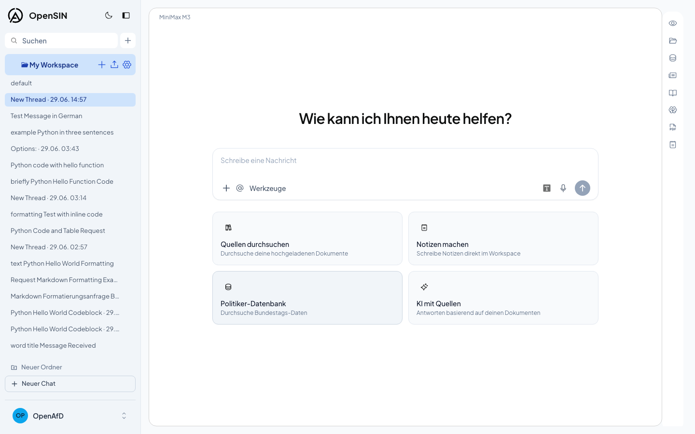 | 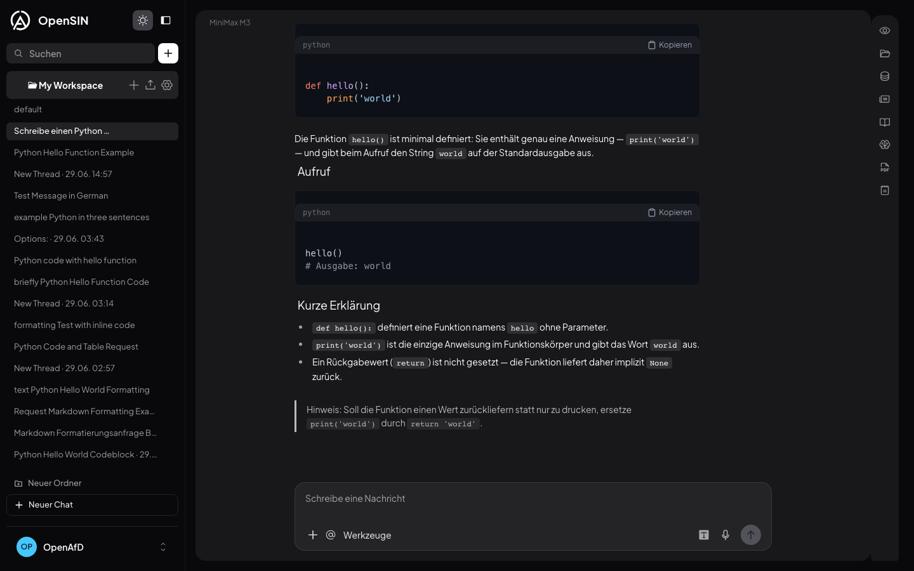 | 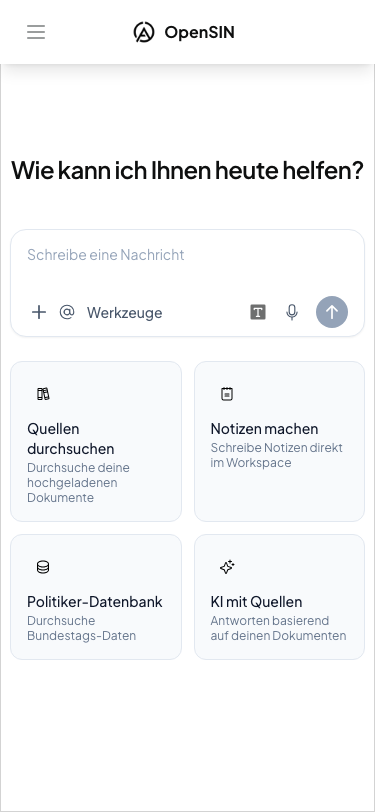 |

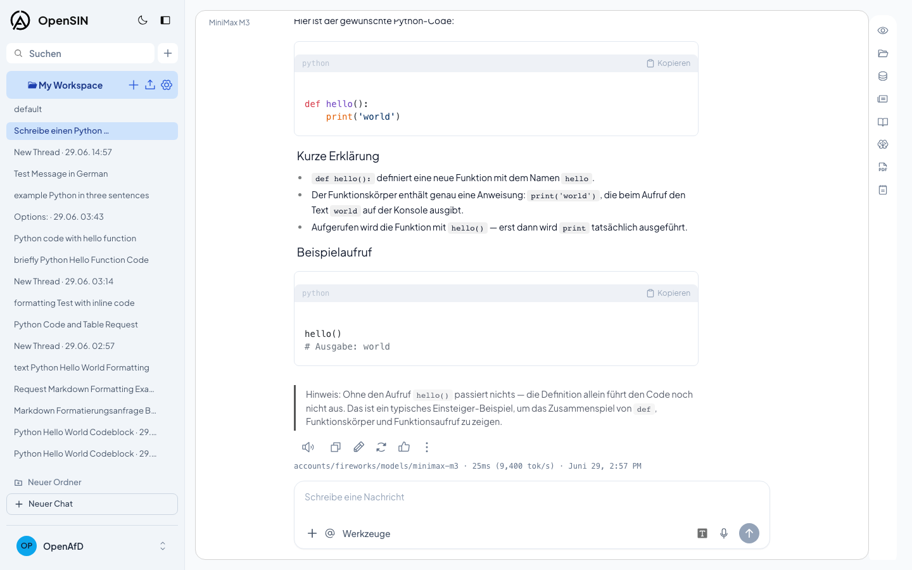
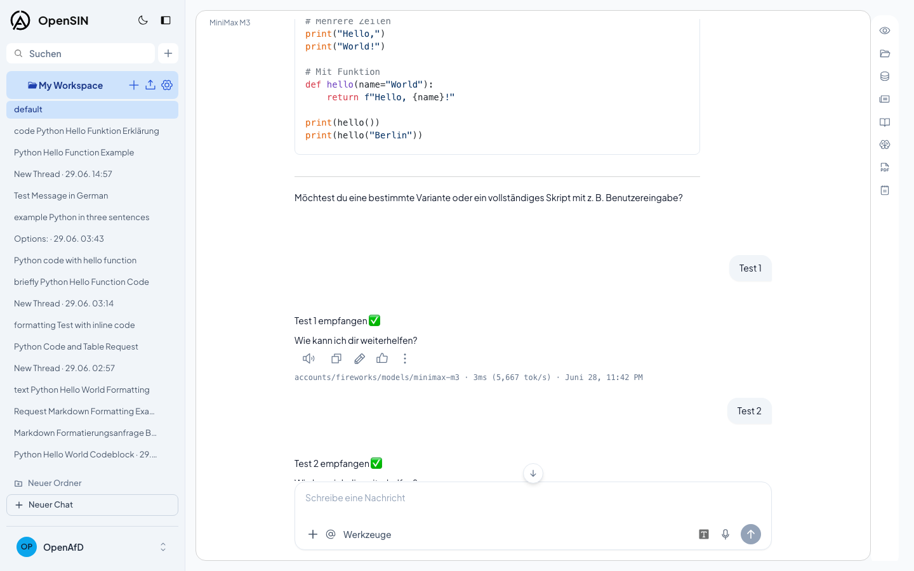

### Overview Video

> 63-second walkthrough of OpenAFD Chat — produced with [OpenMontage](https://github.com/calesthio/OpenMontage) using existing screenshots and Piper TTS (German, local, $0 cost).

<video src="docs/videos/openafd-chat-overview.mp4" controls width="100%"></video>

### ECharts — SOTA Diagramme direkt im Chat

Die KI generiert interaktive Apache ECharts-Diagramme ohne externe Dienste:

| Fraktionsverteilung | AfD nach Bundesland | Redeaktivitat |
|---|---|---|
| 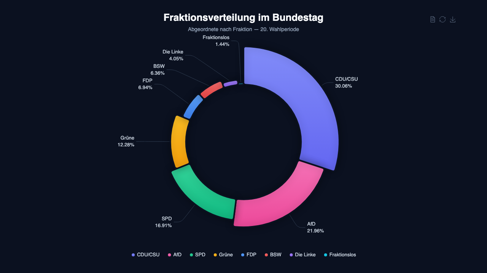 | 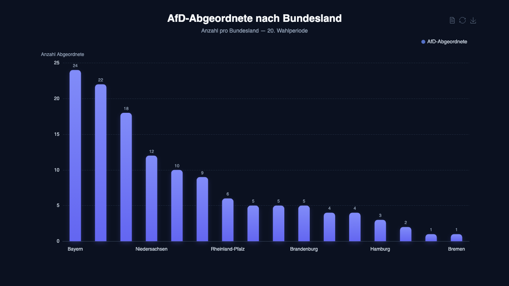 | 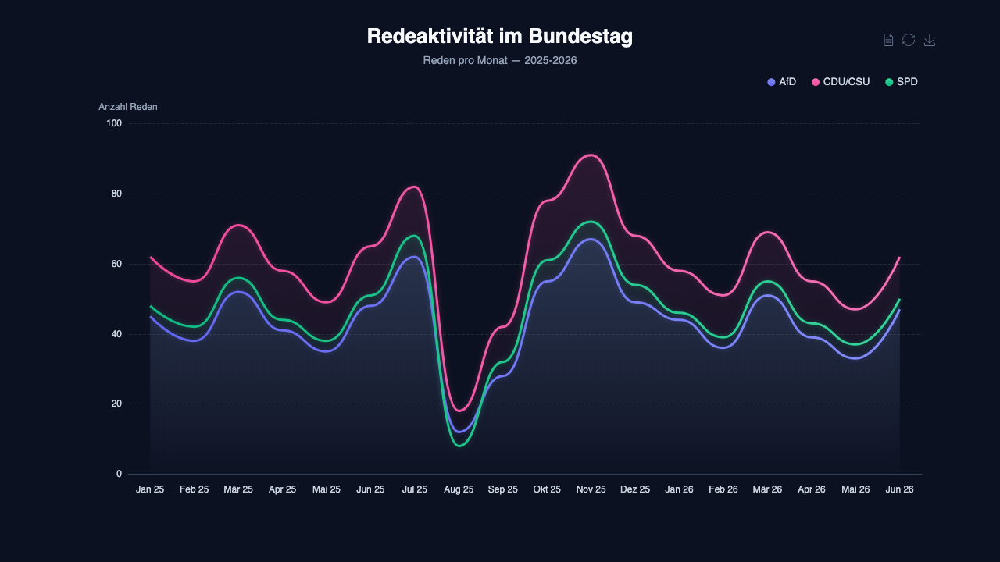 |

| Top Redner | Abstimmungsverhalten | Ausschuss-Prasenz |
|---|---|---|
| 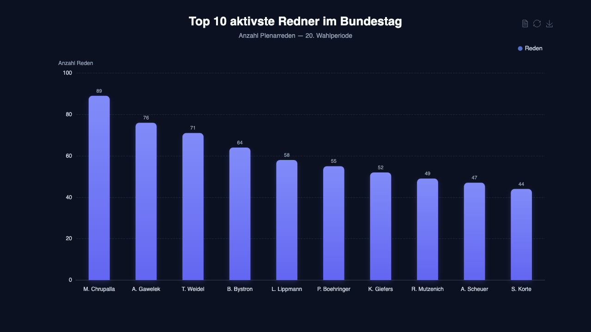 | 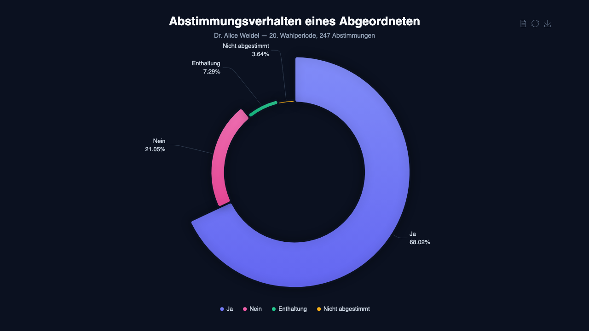 | 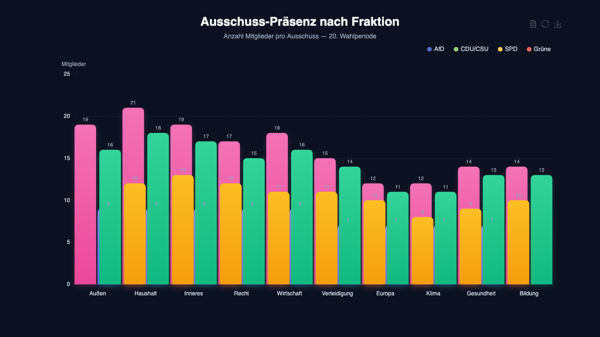 |

## Architecture

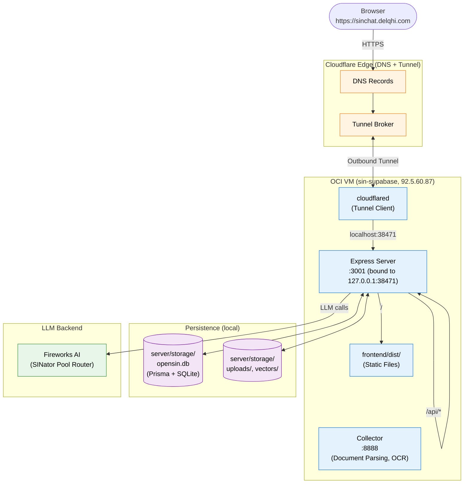

### Repo Structure

```
OpenSIN-Chat/
├── frontend/          Vite + React 18 + TypeScript + Tailwind + i18next
├── server/            Node.js + Express + Prisma + SQLite/Postgres
│   └── utils/
│       ├── politician/    Politician DB (Bundestag + Abgeordnetenwatch)
│       ├── research/      Deep Research Pipeline
│       ├── reports/       PDF Report Generator
│       ├── orchestrator/  Workflow Engine for Agent Plugins
│       └── agents/        Agent Definitions
├── collector/         Python service for document ingestion and OCR
├── docker/            Original Docker setup (legacy)
├── docker-opensin/    OpenSIN-Chat Docker / Compose setup
├── cloud-deployments/ AWS, GCP, Azure, DO, Helm, OpenShift stubs
├── tests/             E2E and integration tests
├── scripts/           Deploy scripts (deploy-production.sh)
└── docs/              Architecture, ADRs, plans, runbooks
```

## Deployment

### Live Demo

**https://sinchat.delqhi.com** — deployed on an OCI VM (`sin-supabase`) via Cloudflare Tunnel, Fireworks AI (SINator Pool Router) as LLM provider.

### Docker Self-Hosting

```bash
cd docker-opensin
cp .env.example .env
# Configure: SERVER_PORT, JWT_SECRET, SIG_KEY/SIG_SALT, LLM keys
docker compose up -d
```

### Bare Metal / Development

See [BARE_METAL.md](./BARE_METAL.md) and [DEPLOYMENT_GUIDE.md](./DEPLOYMENT_GUIDE.md).

### Auto-Deploy

An auto-deploy script polls `origin/main` and rebuilds automatically. Setup in [docs/AUTO-DEPLOY.md](./docs/AUTO-DEPLOY.md).

### Security Notes

- **No credentials in the bundle or repo.** Demo/onboarding passwords must never land in the frontend bundle, README, or commits
- **Secret rotation.** All keys in `.env` (LLM providers, `JWT_SECRET`, `SIG_KEY`/`SIG_SALT`) are deployment-specific (`openssl rand -base64 32`)
- **Research SSRF protection.** The Deep Research Pipeline blocks private/internal targets by default
- **Job limits.** `RESEARCH_MAX_ACTIVE_JOBS` (default 3) and `ORCHESTRATOR_MAX_ACTIVE_WORKFLOWS` (default 2) limit concurrent pipelines

See [SECURITY.md](./SECURITY.md) for details.

## Documentation

- **In-app docs:** Available at `/docs` in the running frontend (user manual, API reference, architecture, deployment runbooks)
- **Source docs:** All Markdown files in [`docs/`](./docs/) are the single source of truth
- **Architecture decisions:** ADRs in [`docs/adr/`](./docs/adr/)
- **Data sources:** [`docs/DATA-SOURCES.md`](./docs/DATA-SOURCES.md) — external API specs, rate limits, schema mapping
- **API reference:** [`docs/api.md`](./docs/api.md)

## Contributing

1. Fork the repository
2. Create your branch (`git checkout -b feature/amazing-feature`)
3. Test your changes (`yarn test` + `yarn test:server`)
4. Commit and push
5. Open a Pull Request

See [CONTRIBUTING.md](./CONTRIBUTING.md) for details. Code conventions, branching strategy, and commit format are documented there.

## License

Distributed under the **MIT License**. See [LICENSE](./LICENSE) for details.

## Credits

OpenSIN Chat was **inspired by** **[AnythingLLM](https://github.com/Mintplex-Labs/anything-llm)** by **[Mintplex Labs Inc.](https://github.com/Mintplex-Labs)** (MIT license), but has since diverged into a fully independent product with nearly 100% of the codebase rewritten or replaced.

We gratefully acknowledge **Timothy Carambat** and the entire Mintplex team. Their early architectural work provided the initial spark for this project.

> *AnythingLLM is a full-stack application that enables you to turn any document, resource, or piece of content into context that any LLM can use as reference during chatting. Built and maintained by Mintplex Labs Inc.*

**What was originally inspired by AnythingLLM:** the basic full-stack structure (frontend + server + collector), LLM/embedding/vector DB provider abstraction, and the agent framework concept.

**What OpenSIN Chat has built independently (nearly 100% rewritten):** complete rebranding (OpenSIN blue, German language, custom logo), all telemetry removed, GDPR-affine defaults, political-use-case specialisation, Politician Database, Deep Research Pipeline, PDF Reports, Agent Plugins, NVIDIA NIM Vision OCR, async upload pipeline with parseJobs, ECharts visualisation, REST APIs, comprehensive test & CI infrastructure, and significant architectural refactoring across frontend, server, and collector.

A full list of third-party components is in [THIRD_PARTY.md](./THIRD_PARTY.md).

---

<!-- OpenSIN AI BRANDING FOOTER -->
<p align="center">
  <picture>
    <source media="(prefers-color-scheme: dark)" srcset="./assets/sin-ai-banner.svg" />
    <source media="(prefers-color-scheme: light)" srcset="./assets/sin-ai-banner-light.svg" />
    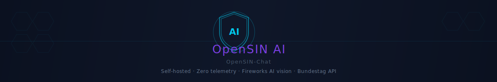
  </picture>
</p>
