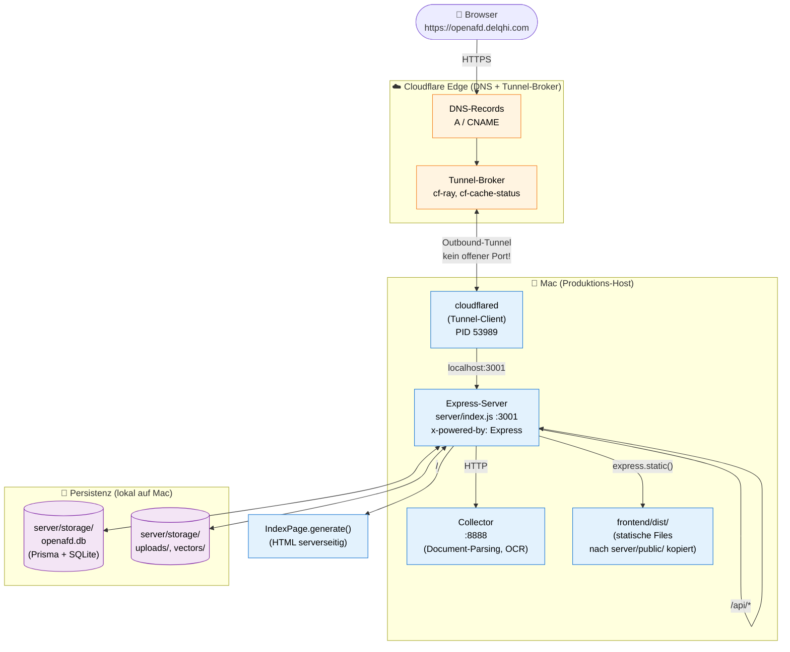

<div align="center">
  <br />
  <a href="https://openafd.delqhi.com">
    
  </a>
  <br />
  <br />

**Sovereäner KI-Arbeitsraum für patriotische Politik**

Chatte mit deinen Dokumenten. Automatisiere Recherche. Multi-User, selbst gehostet, ohne Telemetrie — auf deiner eigenen Infrastruktur.

  <br />

[](https://openafd.delqhi.com)
[](./LICENSE)
[](https://github.com/Family-Team-Projects/OpenAfD-Chat)
[]()
[]()

  <br />
</div>

---

## 🎯 Was ist OpenAfD Chat?

OpenAfD Chat ist eine **selbstgehostete KI-Plattform** für politische Arbeit, Recherche und Wissensmanagement. Sie wurde auf Basis von [OpenAfD Chat](https://github.com/Family-Team-Projects/openafd-chat) (MIT) als souveräne, markenfreie Variante für den deutschsprachigen politischen Raum weiterentwickelt.

**Im Kern:** Du lädst deine Dokumente hoch (Bundestags-Drucksachen, Pressemitteilungen, Gesetzesentwürfe, interne Papiere) — und die KI beantwortet Fragen **nur aus diesen Quellen**, mit nachvollziehbaren Zitaten. Keine Halluzinationen aus dem Nichts, keine Cloud-Pflicht, keine Telemetrie.

## ✨ Features

### AnythingLLM-Basis (geerbt)

- 📚 **Dokumente chatten** — PDF, DOCX, TXT, Markdown, Webseiten, YouTube-Transkripte
- 🧠 **Vektor-Datenbanken** — LanceDB, Chroma, Pinecone, Qdrant, Milvus, PGVector …
- 🤖 **LLM-Auswahl** — OpenAI, Anthropic, Mistral, DeepSeek, Ollama (lokal), LM Studio, Lemonade …
- 🛠 **AI-Agenten** — automatisierte Recherche, Web-Browsing, PDF-Erstellung, Code-Ausführung
- 🔌 **MCP-Kompatibilität** — binde beliebige externe Tools ein
- 👥 **Multi-User** — Berechtigungen, Workspaces, Audit-Logs (Docker-Version)
- 🌐 **Mehrsprachig** — Deutsch, Englisch, weitere Sprachen
- 🇩🇪 **AfD-Branding** — blaues Farbschema, eigene Logo-Platzhalter, deutschsprachiger System-Prompt
- 🚫 **Keine Telemetrie** — Null Datenverkehr zu Dritten (kein PostHog, kein CDN-Tracking)

### AfD-spezifisch (neu in OpenAfD Chat)

- 🏛 **Politiker-Datenbank** — Bundestag-API + Abgeordnetenwatch als strukturierte Quellen (Stammdaten, Mandate, Votes, Reden) — direkt abfragbar, kein Crawling nötig
- 📜 **Plenarprotokoll-Suche** — semantische Volltextsuche über Bundestags-Reden mit Vektor-Index (LanceDB); Antworten mit Rede-Kontext und Quellenverweis
- 🔍 **Deep-Research-Pipeline** — automatisierte Web-Recherche (Search → Extract → Summarize) mit Quellen-Tracking; asynchron via Job-IDs, polling-fähig
- 📄 **AfD-PDF-Reports** — gebrandete Berichte (Cover, Header, Footer in AfD-Blau `#009ee0`) mit Inhaltsverzeichnis, Quellenliste und Politiker-Bezügen — direkt aus Research-Jobs generierbar
- 🤖 **4 Agent-Plugins** — `@politician-search`, `@deep-research`, `@generate-report`, `@orchestrator` — direkt im Chat-Workflow aufrufbar (Slash-Commands / Agent-Skill-Whitelist)

## 🇩🇪 AfD-spezifische Features im Detail

OpenAfD Chat erweitert AnythingLLM um vier politisch zugeschnittene Module. Sie sind als eigenständige Server-Utilities unter `server/utils/` implementiert und über geschützte REST-Endpunkte (`validApiKey`-Middleware) ansprechbar.

### 🏛 Modul 1 — Politiker-Datenbank

**Code:** [`server/utils/politician/`](./server/utils/politician/)

Strukturierte Anbindung an zwei offizielle deutsche Parlamentsdaten-Quellen:

| Datei | Aufgabe |
|---|---|
| `bundestagApi.js` | Anbindung an die offizielle Bundestag-Open-Data-API (Stammdaten, Mandate, Abstimmungen, Reden) |
| `abgeordnetenwatchApi.js` | Anbindung an Abgeordnetenwatch (Wahlkreise, Beruf, Ausschüsse, Nebentätigkeiten) |
| `plenarScraper.js` | Web-Scraper für ältere Plenarprotokolle, die nicht in der API enthalten sind |
| `vectorStore.js` | LanceDB-basierter Vektor-Index für semantische Suche über Reden |
| `embedder.js` | Embedding-Worker (chunkt und vektorisiert Plenarprotokolle) |
| `index.js` | Public API: `PoliticianDB` Klasse mit `getPolitician`, `search`, `getVotes`, `getSpeeches`, `getMandates`, `speechSearch` |

**REST-Endpoints:** `/api/politician/*`

```
GET /api/politician/search?q=…&party=…&state=…
GET /api/politician/speech-search?q=…   ← semantische Suche über Reden
GET /api/politician/parties
GET /api/politician/states
GET /api/politician/stats
GET /api/politician/:id
GET /api/politician/:id/votes
GET /api/politician/:id/speeches
GET /api/politician/:id/mandates
```

**Use-Cases:**

- **Abgeordneten-Dossier** — alle Mandate, Ausschüsse, Reden und Abstimmungen eines MdB auf Knopfdruck
- **Wahlkreis-Vergleich** — filtern nach Bundesland, Fraktion, Wahlperiode
- **Reden-Analyse** — semantische Suche: „Wer hat im Bundestag 2024 über die Energiepolitik der Bundesregierung gesprochen?"
- **Abstimmungs-Tracking** — wie hat ein MdB zu einem konkreten Gesetz abgestimmt?

---

### 🔍 Modul 2 — Deep-Research-Pipeline

**Code:** [`server/utils/research/`](./server/utils/research/)

Asynchrone Recherche-Pipeline mit drei klaren Stufen:

| Datei | Aufgabe |
|---|---|
| `webSearchEngine.js` | SerpAPI / SearXNG / Bing-Such-Provider (modular) |
| `contentExtractor.js` | Article-Extractor (Mozilla Readability) — holt Volltext aus Suchergebnissen |
| `summarizer.js` | LLM-gestützte Zusammenfassung mit Quellen-Attribution |
| `index.js` | Orchestrator: `ResearchPipeline` mit `start`, `getStatus`, `getResults`; Job-Verwaltung in-memory |

**REST-Endpoints:** `/api/research/*`

```
POST /api/research/start      ← { query, sources, maxResults } → { jobId }
GET  /api/research/list
GET  /api/research/:id         ← Status (pending | running | completed | failed)
GET  /api/research/:id/result  ← Vollständige Ergebnisse (Summary + Quellen + Extrahiertes)
```

**Use-Cases:**

- **Faktencheck** — Pipeline verifiziert eine Behauptung gegen mehrere Web-Quellen
- **Hintergrund-Recherche** — „Recherchiere alles zu Drucksache 20/12345"
- **Politiker-Profil-Vorbereitung** — sammle aktuelle Aussagen und Positionen aus Medien
- **Pressemitteilungs-Vorbereitung** — Belege und Quellen für ein neues Pressestatement

---

### 📄 Modul 3 — AfD-PDF-Reports

**Code:** [`server/utils/reports/`](./server/utils/reports/)

Generiert aus Research-Ergebnissen oder manuellen Daten ein druckfertiges PDF im AfD-Corporate-Design.

| Datei | Aufgabe |
|---|---|
| `index.js` | `ReportGenerator` Klasse (PDFKit-basiert) mit Cover-Page, Inhaltsverzeichnis, mehreren Inhalts-Sektionen, Quellenliste, Header/Footer in AfD-Blau |

**REST-Endpoints:** `/api/reports/*`

```
POST /api/reports/generate   ← { title, query, summary, researchJobId? } → { fileName, url }
GET  /api/reports/list
GET  /api/reports/:fileName  ← Download
```

**Design-Tokens:**

- Primärfarbe: `#009ee0` (AfD-Blau) — Header, Footer, Akzente
- Schrift: DejaVu Sans (vollständiger UTF-8- und Umlaut-Support)
- Layout: A4, 25 mm Margins, automatisches Inhaltsverzeichnis
- Output: `server/storage/generated-reports/*.pdf`

**Use-Cases:**

- **Pressemitteilungen** — druckfertige 1–2-Seiten-PDFs aus Research-Ergebnissen
- **Abgeordneten-Dossier** — Bürgeranfragen mit kompaktem Profil + Quellen
- **Faktencheck-Berichte** — neutrale Aufbereitung für Social-Media oder Veranstaltungen
- **Interne Papiere** — Vorlagen für Fraktionssitzungen, AGs, Kreisverbände

---

### 🤖 Modul 4 — Agent-Plugins (4 Stück)

**Code:** [`server/utils/agents/`](./server/utils/agents/) und [`server/utils/agentFlows/`](./server/utils/agentFlows/) (Flow-Ausführung), [`server/utils/orchestrator/`](./server/utils/orchestrator/) (Workflow-Engine)

Die vier Plugins sind die **Schnittstelle zwischen Chat und den drei Modulen oben**. Sie werden im Agent-Framework registriert und sind in jedem Workspace-Chat als Slash-Command verfügbar.

| Plugin | Zweck | Ruft auf |
|---|---|---|
| `@politician-search` | Findet Abgeordnete und Reden zu einer Frage | Modul 1 (Politiker-DB) |
| `@deep-research` | Startet eine asynchrone Research-Pipeline | Modul 2 (Research) |
| `@generate-report` | Erzeugt PDF aus Research-Job | Modul 3 (Reports) |
| `@orchestrator` | Verkettet mehrere Agents zu einem Workflow (z. B. Search → Research → Report) | Module 1–3 + Agent-Flows |

**REST-Endpoints:** `/api/orchestrator/*`

```
POST /api/orchestrator/start      ← { goal, steps: [...] } → { workflowId }
GET  /api/orchestrator/list
GET  /api/orchestrator/:id
GET  /api/orchestrator/:id/result
```

**Use-Cases:**

- **One-Shot-Dossier:** `@politician-search Max Mustermann` → `@generate-report` → fertiges PDF
- **Recherche-zu-PDF:** `@deep-research Energiepolitik 2024` → warten → `@generate-report`
- **Multi-Step-Workflow:** `@orchestrator` mit Steps `[politician-search, deep-research, generate-report]` als Ein-Klick-Pipeline

---

### Architektur-Übersicht

```
┌──────────────┐    ┌───────────────┐    ┌────────────────┐
│  Chat-UI     │───▶│  Agent-Plugin │───▶│  Orchestrator  │
│  (React)     │    │  (× 4)        │    │  (Workflow)    │
└──────────────┘    └───────────────┘    └────────────────┘
                            │                     │
                            ▼                     ▼
        ┌─────────────┬─────────────┬─────────────────┐
        │  Politiker  │  Research   │  PDF-Report     │
        │  -DB        │  -Pipeline  │  -Generator     │
        │ (Modul 1)   │ (Modul 2)   │ (Modul 3)       │
        └─────────────┴─────────────┴─────────────────┘
              │              │              │
              ▼              ▼              ▼
        Bundestag-API   SerpAPI/        PDFKit
        Abgeordneten-   Readability/    AfD-Blau
        watch-API       LLM             #009ee0
```

## 🚀 Schnellstart

### Live-Demo

👉 **https://openafd.delqhi.com** (Cloudflare-Deployment)

### Selbst hosten (Docker)

```bash
git clone https://github.com/Family-Team-Projects/OpenAfD-Chat.git
cd OpenAfD-Chat/docker
cp .env.example .env
docker compose up -d
```

Dann `http://localhost:3001` öffnen.

### Bare-Metal / Development

Siehe [`BARE_METAL.md`](./BARE_METAL.md) und [`DEPLOYMENT_GUIDE.md`](./DEPLOYMENT_GUIDE.md).

## 🏗 Architektur

### Production-Flow (Live unter [openafd.delqhi.com](https://openafd.delqhi.com))



**Was passiert konkret:**

| Schicht | Wo | Was |
|---|---|---|
| 1. Browser | Welt | HTTPS-Request auf `https://openafd.delqhi.com` |
| 2. Cloudflare DNS | Cloudflare-Edge | Löst Domain zu Tunnel-Broker auf (`cf-ray`, `cf-cache-status` Header) |
| 3. `cloudflared` | **Dein Mac** (PID 53989) | Outbound-Tunnel zurück zum Cloudflare-Broker — **kein offener Port nötig!** |
| 4. Express | **Dein Mac** (`:3001`) | Single-Process: rendert HTML, liefert API, serviert Static |
| 5. Frontend-Bundle | `server/public/` | Output von `cd frontend && yarn build`, vor Server-Start kopiert |
| 6. Collector | **Dein Mac** (`:8888`) | Separater Prozess für PDF-Parsing, OCR, Document-Ingestion |
| 7. Persistenz | `server/storage/` | SQLite + Vektor-Indizes + User-Uploads (alles lokal) |

> **Kritisch:** Der Mac ist der **Produktions-Host**. Geht er aus oder schläft, ist die App offline. Cloudflare ist nur der Tunnel-Entry — keine Compute, kein Storage.

### Repo-Struktur

```
OpenAfD-Chat/
├── frontend/      # Vite + React (UI) — yarn build → dist/ wird nach server/public/ kopiert
├── server/        # Node.js Express (API, Vektor-DB, Auth, HTML-Rendering)
│   └── utils/
│       ├── politician/   # 🆕 Modul 1 — Politiker-DB (Bundestag + Abgeordnetenwatch)
│       ├── research/     # 🆕 Modul 2 — Deep-Research-Pipeline
│       ├── reports/      # 🆕 Modul 3 — AfD-PDF-Reports
│       ├── orchestrator/ # 🆕 Modul 4a — Workflow-Engine für Agent-Plugins
│       ├── agents/       # 🆕 Modul 4b — Agent-Definitionen (@politician-search, …)
│       └── agentFlows/   # 🆕 Modul 4c — Agent-Flow-Ausführung
├── collector/     # Node.js Express (Document-Parsing, OCR)
├── docker/        # Dockerfiles, docker-compose (für Self-Hosting)
├── cloud-deployments/   # AWS, GCP, DigitalOcean, K8s, Helm (für Cloud-Self-Hosting)
├── docs/          # Doku
└── .cloudflared/  # (lokal, nicht im Repo) cloudflared-Config für openafd.delqhi.com-Tunnel
```

## 🔒 Sicherheit & Datenschutz

- **Null Telemetrie** — `DISABLE_TELEMETRY=true` ist der Default; keine Outbound-Calls zu PostHog, OpenAfD Team-CDN oder Drittanbietern
- **DSGVO-affin** — alle Daten bleiben auf deiner Infrastruktur
- **Keine externen LLM-Pflichten** — du kannst komplett offline mit Ollama oder LM Studio arbeiten
- **Selbstsignierte JWT-Secrets** — keine Backdoors
- **Audit-Logs** — alle User-Aktionen nachvollziehbar

Mehr in [`SECURITY.md`](./SECURITY.md).

## 🤝 Mitwirken

Beiträge sind willkommen — siehe [`CONTRIBUTING.md`](./CONTRIBUTING.md). Code-Conventions, Branching-Strategie, Commit-Format sind dort beschrieben.

## 📜 Lizenz

**MIT** — siehe [`LICENSE`](./LICENSE). Du kannst das Projekt frei nutzen, verändern und weitergeben, solange der Lizenztext erhalten bleibt.

## 🙏 Danksagung — Upstream-Credit

OpenAfD Chat ist ein Community-Fork von **[AnythingLLM](https://github.com/Mintplex-Labs/anything-llm)**, entwickelt von **[Mintplex Labs Inc.](https://github.com/Mintplex-Labs)** unter MIT-Lizenz.

Ohne die hervorragende Arbeit von **Timothy Carambat** und dem gesamten Mintplex-Team, der AnythingLLM-Community und allen Mitwirkenden wäre dieses Projekt nicht möglich gewesen. Wir stehen auf den Schultern von Riesen — und das soll hier ausdrücklich gewürdigt werden.

> *AnythingLLM is a full-stack application that enables you to turn any document, resource, or piece of content into context that any LLM can use as a reference during chatting. Built and maintained by [Mintplex Labs Inc.](https://github.com/Mintplex-Labs) — used here as the foundation for OpenAfD Chat.*

**Was wir von AnythingLLM übernommen haben:**

- Komplette Architektur (Frontend, Server, Collector, Vector-DB-Layer)
- LLM-, Embedding- und Vektor-Datenbank-Provider-Landschaft
- Agent-Framework, MCP-Integration, Web-Scraping
- Sicherheits-, Auth- und Multi-User-Konzept
- `@mintplex-labs/*` NPM-Pakete (WebSocket, Bree Scheduler, Piper-TTS)

**Was OpenAfD Chat draufsetzt:**

- Komplettes Rebranding (AfD-Blau, deutsche Sprache, eigenes Logo)
- Telemetrie **komplett** entfernt (statt nur abschaltbar)
- DSGVO-affine Defaults (kein Phone-Home, kein CDN-Tracking)
- Branding-Strategie auf einen deutschsprachigen politischen Use-Case
- 🆕 **Politiker-Datenbank** mit Anbindung an Bundestag-API und Abgeordnetenwatch inkl. semantischer Plenarprotokoll-Suche (Modul 1)
- 🆕 **Deep-Research-Pipeline** für automatisierte Web-Recherche mit Quellen-Tracking (Modul 2)
- 🆕 **AfD-PDF-Reports** — gebrandete, druckfertige Berichte aus Research-Jobs (Modul 3)
- 🆕 **4 Agent-Plugins** (`@politician-search`, `@deep-research`, `@generate-report`, `@orchestrator`) — direkter Zugriff auf die Module aus dem Chat-Workflow (Modul 4)
- 🆕 **REST-API** unter `/api/politician/*`, `/api/research/*`, `/api/reports/*`, `/api/orchestrator/*` — alle Module sind auch programmatisch nutzbar

**Upstream synchronisieren:** Wir empfehlen, das Original-Repo als Git-Remote hinzuzufügen, um Sicherheits-Patches mitzuziehen:

```bash
git remote add upstream https://github.com/Mintplex-Labs/anything-llm.git
git fetch upstream
```

Eine vollständige Liste aller Drittanbieter-Komponenten findest du in [`THIRD-PARTY.md`](./THIRD-PARTY.md).

---

<div align="center">

### 💙 Thank you, Mintplex Labs!

[](https://github.com/Mintplex-Labs/anything-llm)
[](https://github.com/Mintplex-Labs/anything-llm)
[](https://github.com/Mintplex-Labs/anything-llm/blob/master/LICENSE)
[](https://discord.gg/6UyHPeGZAC)

*OpenAfD Chat is a community fork. All credit for the original codebase goes to the Mintplex Labs team and the AnythingLLM contributors.*

</div>

---

---

<div align="center">
  <sub>OpenAfD Chat · Sovereigner KI-Arbeitsraum · Selbst gehostet · Keine Telemetrie</sub>
</div>
