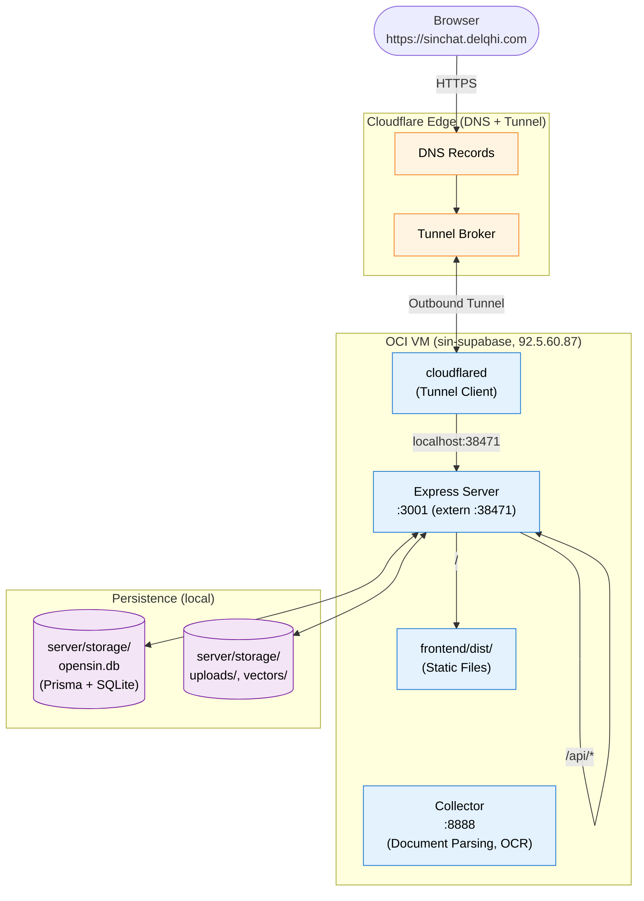

<a name="readme-top"></a>

# OpenSIN Chat

<p align="center">
  <em>Self-hosted AI workspace for political research — chat with documents, search the Bundestag, generate reports.</em>
</p>

<!-- BADGES -->
<p align="center">
  <a href="https://sinchat.delqhi.com">
    
  </a>
  <a href="./LICENSE">
    
  </a>
  <a href="https://github.com/OpenSIN-AI/OpenSIN-Chat">
    
  </a>
</p>

<!-- QUICK LINKS -->
<p align="center">
  <a href="#quick-start">Quick Start</a> |
  <a href="#features">Features</a> |
  <a href="#architecture">Architecture</a> |
  <a href="#deployment">Deployment</a> |
  <a href="#credits">Credits</a>
</p>

<!-- HERO BANNER (custom SVG, dual-mode) -->
<picture>
  <source media="(prefers-color-scheme: dark)" srcset="./assets/hero-banner.svg" />
  <source media="(prefers-color-scheme: light)" srcset="./assets/hero-banner-light.svg" />
  
</picture>

---

OpenSIN Chat is a **self-hosted AI platform** for political work, research, and knowledge management. Upload your documents (Bundestag papers, press releases, legislation drafts) and the AI answers questions **only from your sources**, with traceable citations. No hallucinations from thin air, no cloud dependency, zero telemetry.

A sovereign, independent product built by [OpenSIN-AI](https://github.com/OpenSIN-AI) and optimized for the German political sphere. Originally inspired by AnythingLLM, OpenSIN Chat has evolved into a purpose-built system for political research with specialized agents, politician databases, and compliance features.

## Quick Start

```bash
git clone https://github.com/OpenSIN-AI/OpenSIN-Chat.git
cd OpenSIN-Chat/docker-opensin
cp .env.example .env
docker compose up -d
```

The container maps host port `43939` to internal port `3001`. Open `http://localhost:43939` after startup.

> [!NOTE]
> For full setup instructions, environment variables, and bare-metal deployment, see [DEPLOYMENT_GUIDE.md](./DEPLOYMENT_GUIDE.md).

## Features

### Core Features

- **Document Chat** — PDF, DOCX, TXT, Markdown, web pages, YouTube transcripts
- **Vector Databases** — LanceDB, Chroma, Pinecone, Qdrant, Milvus, PGVector
- **12+ LLM Providers** — OpenAI, Anthropic, Mistral, DeepSeek, Ollama (local), LM Studio, Fireworks AI
- **AI Agents** — automated research, web browsing, PDF creation, code execution
- **MCP Compatible** — integrate any external tool via Model Context Protocol
- **Multi-User** — permissions, workspaces, audit logs (Docker edition)
- **Multilingual** — German, English, and more
- **Zero Telemetry** — no PostHog, no CDN tracking, no outbound calls to third parties

### Political Research & OpenSIN-AI Specializations

- **Politician Database** — Bundestag API + Abgeordnetenwatch as structured sources (biographical data, mandates, votes, speeches). Semantic full-text search over plenary protocols via LanceDB vector index
- **Deep Research Pipeline** — automated web research (Search → Extract → Summarize) with source tracking. Async via job IDs, polling-capable
- **OpenSIN PDF Reports** — branded reports (cover, header, footer in OpenSIN blue `#009ee0`) with table of contents, source lists, and politician references — generated directly from research jobs
- **Agent Plugins** — `@politician-search`, `@deep-research`, `@generate-report`, `@orchestrator`, `@pdf-analyze`, `@browser-vision`, `@image-generation`, `@create-files` — callable directly in chat
- **Fireworks AI Vision** — multimodal image analysis via Fireworks AI models (minimax-m3, kimi-k2p5/6/7, qwen-3p7-plus). Upload images and the AI describes what it sees
- **3,000+ Tests** — comprehensive frontend (Vitest) and server (Jest) test coverage

## Architecture



### Repo Structure

```
OpenSIN-Chat/
├── frontend/          Vite + React 18 + TypeScript + Tailwind + i18next
├── server/            Node.js + Express + Prisma + SQLite/Postgres
│   └── utils/
│       ├── politician/    Politician DB (Bundestag + Abgeordnetenwatch)
│       ├── research/      Deep Research Pipeline
│       ├── reports/       PDF Report Generator
│       ├── orchestrator/  Workflow Engine for Agent Plugins
│       └── agents/        Agent Definitions
├── collector/         Python service for document ingestion and OCR
├── docker/            Original Docker setup (openafd)
├── docker-opensin/    OpenSIN-Chat Docker / Compose setup
├── cloud-deployments/ AWS, GCP, Azure, DO, Helm, OpenShift stubs
├── tests/             E2E and integration tests
├── scripts/           Deploy scripts (deploy-production.sh)
└── docs/              Architecture, ADRs, plans, runbooks
```

## Deployment

### Live Demo

**https://sinchat.delqhi.com** — deployed on an OCI VM (`sin-supabase`) via Cloudflare Tunnel.

### Docker Self-Hosting

```bash
cd docker-opensin
cp .env.example .env
# Configure: SERVER_PORT, JWT_SECRET, SIG_KEY/SIG_SALT, LLM keys
docker compose up -d
```

### Bare Metal / Development

See [BARE_METAL.md](./BARE_METAL.md) and [DEPLOYMENT_GUIDE.md](./DEPLOYMENT_GUIDE.md).

### Auto-Deploy

An auto-deploy script polls `origin/main` and rebuilds automatically. Setup in [docs/AUTO-DEPLOY.md](./docs/AUTO-DEPLOY.md).

### Security Notes

- **No credentials in the bundle or repo.** Demo/onboarding passwords must never land in the frontend bundle, README, or commits
- **Secret rotation.** All keys in `.env` (LLM providers, `JWT_SECRET`, `SIG_KEY`/`SIG_SALT`) are deployment-specific (`openssl rand -base64 32`)
- **Research SSRF protection.** The Deep Research Pipeline blocks private/internal targets by default
- **Job limits.** `RESEARCH_MAX_ACTIVE_JOBS` (default 3) and `ORCHESTRATOR_MAX_ACTIVE_WORKFLOWS` (default 2) limit concurrent pipelines

See [SECURITY.md](./SECURITY.md) for details.

## Documentation

- **In-app docs:** Available at `/docs` in the running frontend (user manual, API reference, architecture, deployment runbooks)
- **Source docs:** All Markdown files in [`docs/`](./docs/) are the single source of truth
- **Architecture decisions:** ADRs in [`docs/adr/`](./docs/adr/)
- **Data sources:** [`docs/DATA-SOURCES.md`](./docs/DATA-SOURCES.md) — external API specs, rate limits, schema mapping
- **API reference:** [`docs/API.md`](./docs/API.md)

## Contributing

1. Fork the repository
2. Create your branch (`git checkout -b feature/amazing-feature`)
3. Test your changes (`yarn test` + `yarn test:server`)
4. Commit and push
5. Open a Pull Request

See [CONTRIBUTING.md](./CONTRIBUTING.md) for details. Code conventions, branching strategy, and commit format are documented there.

## License

Distributed under the **MIT License**. See [LICENSE](./LICENSE) for details.

## Credits

OpenSIN Chat is a community fork of **[AnythingLLM](https://github.com/Mintplex-Labs/anything-llm)**, developed by **[Mintplex Labs Inc.](https://github.com/Mintplex-Labs)** under MIT license.

Without the excellent work of **Timothy Carambat** and the entire Mintplex team, the AnythingLLM community, and all contributors, this project would not be possible.

> *AnythingLLM is a full-stack application that enables you to turn any document, resource, or piece of content into context that any LLM can use as reference during chatting. Built and maintained by Mintplex Labs Inc. — used here as the foundation for OpenSIN Chat.*

**What we inherited from AnythingLLM:** complete architecture (frontend, server, collector, vector DB layer), LLM/embedding/vector DB providers, agent framework, MCP integration, web scraping, security/auth/multi-user concept, `@mintplex-labs/*` NPM packages.

**What OpenSIN Chat adds on top:** complete rebranding (OpenSIN blue, German language, custom logo), telemetry fully removed (not just disableable), GDPR-affine defaults, political-use-case branding, Politician Database, Deep Research Pipeline, PDF Reports, Agent Plugins, REST APIs, test & CI infrastructure.

A full list of third-party components is in [THIRD-PARTY.md](./THIRD-PARTY.md).

---

<!-- OpenSIN AI BRANDING FOOTER -->
<p align="center">
  <picture>
    <source media="(prefers-color-scheme: dark)" srcset="./assets/sin-ai-banner.svg" />
    <source media="(prefers-color-scheme: light)" srcset="./assets/sin-ai-banner-light.svg" />
    
  </picture>
</p>
