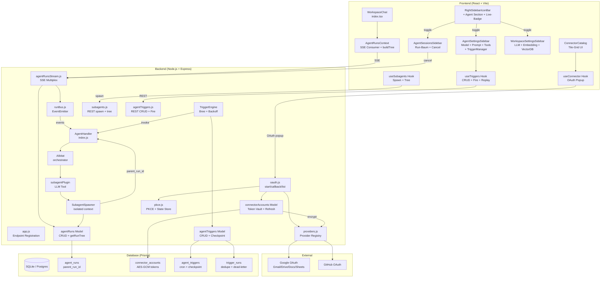
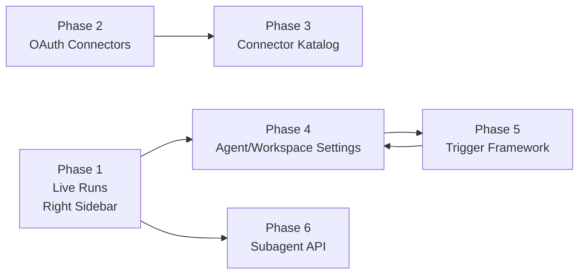
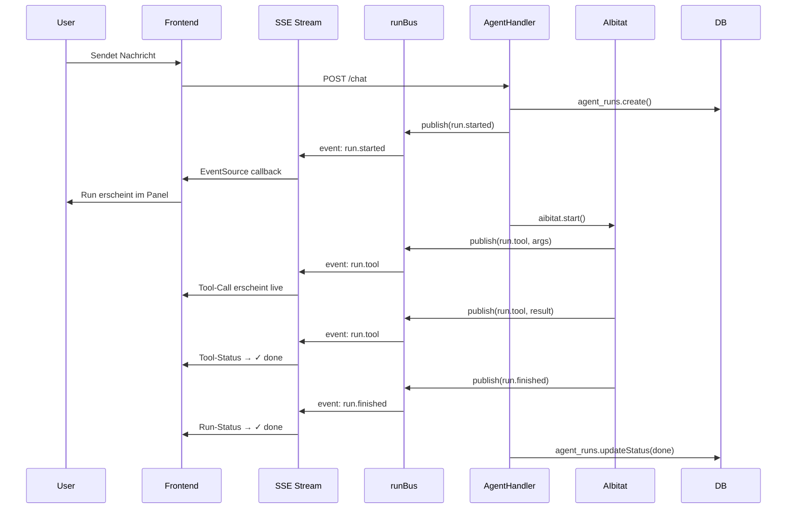
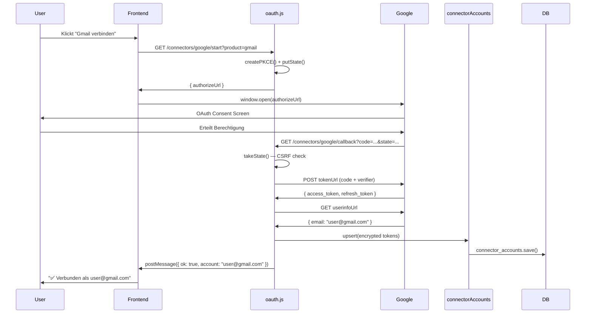
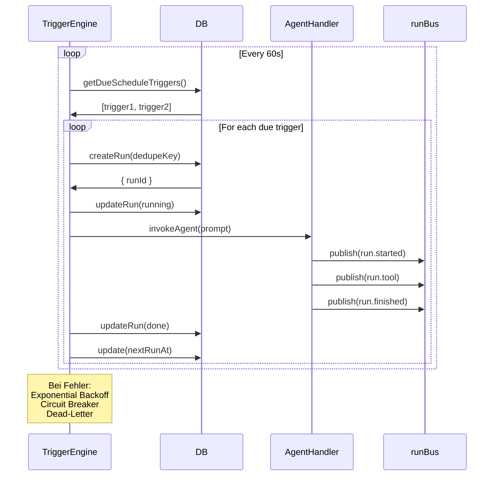

<!-- SPDX-License-Identifier: MIT -->
# Architektur-Diagramm — OpenSIN-Chat Gumloop-Parität

> Visueller Überblick wie alle 6 Phasen + 37 Dateien zusammenhängen.

## Gesamtarchitektur (Mermaid)

## Phasen-Abhängigkeiten

## Datenfluss: Agent-Run → Live-Anzeige

## Datenfluss: OAuth Connect

## Datenfluss: Trigger-Ausführung

## Datei-Zuordnung nach Phase

| Phase | Neue Dateien | Modifizierte Dateien |
|---|---|---|
| **1** | runBus.js, agentRuns.js, agentRunsStream.js, AgentRunsContext.tsx, AgentSessionsSidebar/index.tsx, RightSidebarIconBar/index.tsx, AgentSettingsSidebar (placeholder), WorkspaceSettingsSidebar (placeholder) | app.js, WorkspaceChat/index.tsx |
| **2** | providers.js, pkce.js, connectorAccounts.js, oauth.js, useConnector.ts | GMailSkillPanel (optional) |
| **3** | connectorCatalog.ts, ConnectorCatalog/index.tsx | App.tsx (Route) |
| **4** | AgentSettingsSidebar (full), WorkspaceSettingsSidebar (full), 5 Unit-Test-Suites | — |
| **5** | agentTriggers.js (model), triggerEngine.js, agentTriggers.js (endpoint), useTriggers.ts, TriggerManager.tsx | app.js, AgentSettingsSidebar |
| **6** | subagentSpawner.js, subagentPlugin.js, subagents.js, useSubagents.ts | plugins/index.js, agents/index.js, app.js, WorkspaceChat/index.tsx |
