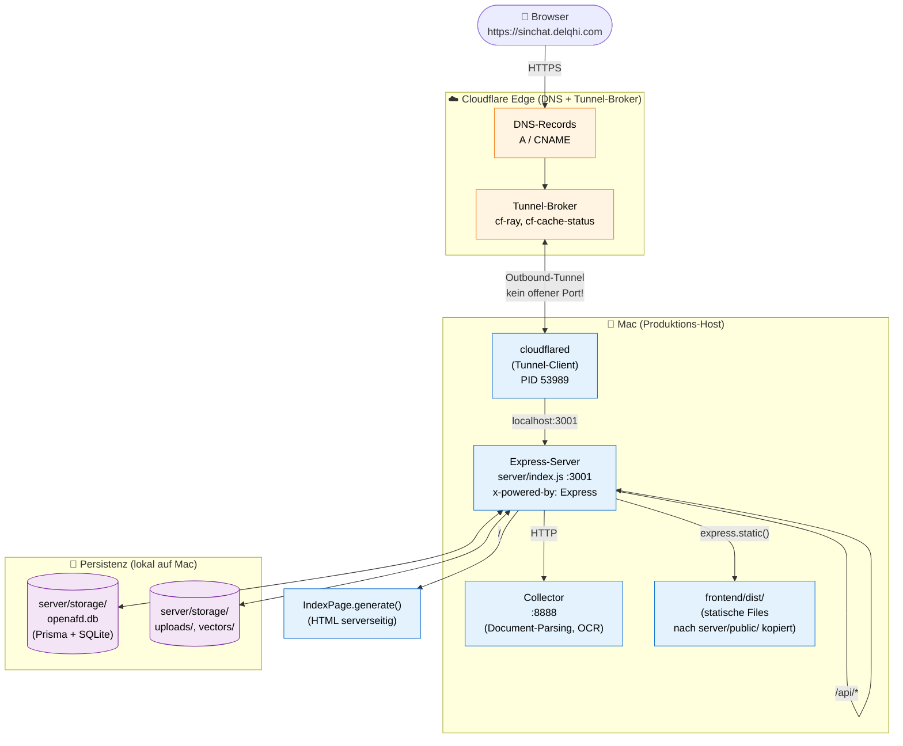

# Production-Architektur

> **Single source of truth** für „wo läuft sinchat.delqhi.com eigentlich?".
> Wenn du (oder ein Agent) wissen willst, wie die Live-Deployment-Topologie aussieht — lies dieses Doc zuerst.

**Live-URL:** https://sinchat.delqhi.com
**Letzte Aktualisierung:** 2026-06-07
**Owner:** Delqhi (Jeremy Schulze)

---

## TL;DR

```
Internet → Cloudflare DNS → Cloudflare-Tunnel-Broker
                                ↓ outbound
                          cloudflared (dein Mac)
                                ↓ localhost:3001
                            Express (server/index.js)
                                ├── /        → HTML (IndexPage.generate)
                                ├── /api/*   → JSON-API
                                ├── /static  → frontend/dist/
                                └── (HTTP)   → Collector :8888
                                            ↓
                              SQLite + Vektor-Indizes + Uploads
                                    (lokal auf Mac)
```

**Der Mac IST der Produktions-Server.** Cloudflare ist nur ein sicherer Entry-Point ohne offene Ports. Kein Vercel, kein Cloudflare-Pages, kein Docker-Cloud-Deploy, kein AWS/GCP — alles lokal.

---

## 1. Production-Flow



**Was passiert konkret, Schicht für Schicht:**

| # | Schicht | Wo | Was |
|---|---|---|---|
| 1 | Browser | Welt | HTTPS-Request auf `https://sinchat.delqhi.com` |
| 2 | Cloudflare DNS | Cloudflare-Edge | Löst Domain zum Tunnel-Broker auf (siehe `cf-ray` Header) |
| 3 | Cloudflare-Tunnel-Broker | Cloudflare-Edge | Nimmt HTTPS-Request entgegen, leitet über bestehenden Outbound-Tunnel an `cloudflared` weiter |
| 4 | `cloudflared` | **Dein Mac** (PID 53989) | Hält persistenten Outbound-Tunnel zum Cloudflare-Broker. **Kein offener Port auf dem Mac nötig!** |
| 5 | Express | **Dein Mac** (`:3001`) | Single-Process: rendert HTML, liefert API, serviert Static. Siehe `x-powered-by: Express` Header. |
| 6 | Frontend-Bundle | `server/public/` | Output von `cd frontend && yarn build`, vor Server-Start nach `server/public/` kopiert |
| 7 | Collector | **Dein Mac** (`:8888`) | Separater Prozess für PDF-Parsing, OCR, Document-Ingestion |
| 8 | Persistenz | `server/storage/` | SQLite + Vektor-Indizes + User-Uploads (alles lokal) |

> **Kritisch:** Der Mac ist der **Produktions-Host**. Geht er aus, schläft, oder wird die WLAN-Verbindung getrennt, ist die App offline. Cloudflare ist nur ein sicherer Entry — keine Compute, kein Storage.

---

## 2. Komponenten

### 2.1 Cloudflare (DNS + Tunnel-Broker)

**Rolle:** Domain-Resolution + sicherer Entry-Point. Hält die HTTPS-Zertifikate und terminiert TLS.

**Was es NICHT macht:**
- Kein Caching von dynamischen Inhalten (`cache-control: no-cache, no-store, must-revalidate` zeigt das — der Server setzt das explizit)
- Kein Edge-Compute (keine Workers, keine Pages)
- Kein Storage

**Konfiguration:**
- Domain: `delqhi.com` (Cloudflare-Account: `gigigigogo-6008` bzw. `laeunduasf-4456` — historisch gewachsen)
- Subdomain: `sinchat.delqhi.com`
- DNS-Record: CNAME auf den Tunnel-Broker
- Tunnel-Name: `opensin-chat`
- Tunnel-ID: in `~/.cloudflared/config-openafd.yml`

### 2.2 `cloudflared` (Tunnel-Client)

**Rolle:** Hält einen outbound-verschlüsselten Tunnel von deinem Mac zum Cloudflare-Broker offen. Nimmt HTTP-Requests vom Broker entgegen und leitet sie an `localhost:3001` weiter.

**Prozess-Details:**
- Binary: `cloudflared` (Homebrew: `brew install cloudflared`)
- Config: `~/.cloudflared/config-openafd.yml`
- Läuft als User-Prozess (nicht als Daemon — startet beim Login via LaunchAgent)
- PID-Beispiel: 53989 (ändert sich bei jedem Start)
- Logs: `~/.cloudflared/`

**Config-Schema (`config-openafd.yml`):**

```yaml
tunnel: <TUNNEL-UUID>
credentials-file: /Users/simoneschulze/.cloudflared/<TUNNEL-UUID>.json

ingress:
  - hostname: sinchat.delqhi.com
    service: http://localhost:3001
  - service: http_status:404
```

**Starten:**

```bash
# Einmalig beim Login
brew services start cloudflared

# Oder manuell (für Debug)
cloudflared tunnel --config ~/.cloudflared/config-openafd.yml run opensin-chat
```

**Status prüfen:**

```bash
ps aux | grep cloudflared | grep -v grep
# Erwartet: cloudflared tunnel --config /Users/simoneschulze/.cloudflared/config-openafd.yml run opensin-chat
```

### 2.3 Express-Server (`server/index.js`)

**Rolle:** Der eigentliche App-Server. Single-Process-Multitool:
- Rendert die HTML-Seite serverseitig (kein SSR-Framework — direkter String-Template über `IndexPage.generate()`)
- Liefert die JSON-API unter `/api/*`
- Serviert statische Files aus `server/public/`
- Spricht mit dem Collector-Prozess für Document-Ingestion
- Verwaltet SQLite + Vektor-Indizes

**Port:** `:3001` (lokal)

**Starten (Production):**

```bash
# Build-Frontend bauen + in server/public/ kopieren
cd /Users/jeremy/dev/OpenSIN-Chat/frontend && yarn build
rm -rf /Users/jeremy/dev/OpenSIN-Chat/server/public
cp -R /Users/jeremy/dev/OpenSIN-Chat/frontend/dist /Users/jeremy/dev/OpenSIN-Chat/server/public

# Prisma-Migrationen
cd /Users/jeremy/dev/OpenSIN-Chat/server
npx prisma generate --schema=./prisma/schema.prisma
npx prisma migrate deploy --schema=./prisma/schema.prisma

# Server starten
NODE_ENV=production node index.js
```

**Auto-Restart:** Aktuell NICHT konfiguriert. Wenn der Prozess stirbt, muss manuell neugestartet werden. TODO: LaunchAgent hinzufügen.

**Health-Check:**

```bash
curl -I http://localhost:3001/api/ping
# Erwartet: HTTP/1.1 200 OK, x-powered-by: Express
```

### 2.4 Collector (`collector/`)

**Rolle:** Separater Node.js-Prozess für CPU-intensive Document-Operations:
- PDF-Parsing
- OCR (Tesseract.js)
- Web-Scraping
- YouTube-Transkript-Extraktion
- Document-Chunking

**Port:** `:8888` (intern, nicht öffentlich erreichbar)

**Starten:**

```bash
cd /Users/jeremy/dev/OpenSIN-Chat/collector
NODE_ENV=production node index.js
```

**Warum separat:** Schwere Document-Jobs blockieren sonst den Express-Mainthread und machen die UI unresponsive. Der Express-Server routet Document-Jobs per HTTP an den Collector.

### 2.5 Frontend-Bundle (`frontend/dist` → `server/public`)

**Rolle:** Statischer React/Vite-Build, der vor dem Express-Start in `server/public/` kopiert wird. Wird vom Express-Server via `express.static()` ausgeliefert.

**Build-Befehl:**

```bash
cd /Users/jeremy/dev/OpenSIN-Chat/frontend
yarn install
yarn build
# Output: frontend/dist/
```

**Verzeichnis-Layout nach Build:**

```
server/public/
├── index.html          # vom Express als "/" gerendert (überschrieben mit IndexPage.generate)
├── assets/
│   ├── index-abc123.js
│   ├── index-def456.css
│   └── ...
└── ...                 # andere statische Files
```

**Wichtig:** Die `index.html` in `server/public/` wird vom Express IGNORIERT, weil `IndexPage.generate(response)` die HTML dynamisch baut. Das spart einen Roundtrip und erlaubt es, ENV-Variablen (z.B. `VITE_API_BASE`) direkt ins HTML zu injizieren.

### 2.6 Persistenz

**SQLite (`server/storage/openafd.db`):**
- Prisma-Schema in `server/prisma/schema.prisma`
- User, Workspaces, Threads, Chats, etc.
- WAL-Mode für Concurrency

**Vektor-Indizes (`server/storage/vectors/`):**
- LanceDB default (siehe `server/utils/vectorDbProviders/lance/`)
- Auch: Chroma, Pinecone, Qdrant, Milvus, PGVector verfügbar
- Pro Workspace ein Sub-Verzeichnis

**User-Uploads (`server/storage/uploads/`):**
- Original-Files (PDF, DOCX, etc.)
- Werden NIE gelöscht — User-Daten sind heilig

**Wichtig:** Alles auf dem Mac. Keine Cloud-Persistenz. Wenn der Mac stirbt, sind alle Daten weg (außer du machst Backups — siehe unten).

---

## 3. Netzwerk-Topologie

### Ports

| Port | Service | Öffentlich? | Firewall |
|---|---|---|---|
| `:3001` | Express (Hauptserver) | Nein (nur via Tunnel erreichbar) | Loopback only |
| `:8888` | Collector | Nein (intern) | Loopback only |
| `:80` / `:443` | Cloudflare-Tunnel (über `cloudflared`) | Ja (HTTPS) | Outbound only |

**Kritisch:** Es gibt **keinen offenen Port auf dem Mac** im klassischen Sinn. Cloudflare Tunnel funktioniert outbound — `cloudflared` initiiert die Verbindung zum Cloudflare-Broker, nicht umgekehrt. Das macht das Setup hinter NAT, Firewall oder CGNAT problemlos möglich.

### Domain-Resolution

```bash
$ dig +short sinchat.delqhi.com
188.114.96.3
188.114.97.3

$ curl -sI https://sinchat.delqhi.com
HTTP/2 200
server: cloudflare
cf-ray: a07f700baa155053-TXL
x-powered-by: Express
```

Die IPs `188.114.96.3` und `188.114.97.3` sind Cloudflare-Anycast — der tatsächliche Server-Standort variiert. Der `x-powered-by: Express` Header bestätigt, dass die Antwort von deinem Mac kommt (nicht von Cloudflare-Cache).

---

## 4. Operations-Runbook

### 4.1 Tägliche Checks

```bash
# 1. cloudflared läuft?
ps aux | grep cloudflared | grep -v grep

# 2. Express läuft?
curl -sI http://localhost:3001/api/ping

# 3. Collector läuft?
curl -sI http://localhost:8888/api/ping

# 4. Live-URL erreichbar?
curl -sI https://sinchat.delqhi.com
```

### 4.2 Nach Code-Änderungen

```bash
# Im Repo-Root
cd /Users/jeremy/dev/OpenSIN-Chat

# 1. Frontend neu bauen
cd frontend && yarn build && cd ..

# 2. Dist nach server/public/ kopieren
rm -rf server/public
cp -R frontend/dist server/public

# 3. Server neu starten (alter Prozess muss sterben)
pkill -f "node.*server/index.js"
cd server
NODE_ENV=production node index.js &

# 4. Health-Check
sleep 2 && curl -sI http://localhost:3001/api/ping
```

### 4.3 Wenn die App offline ist

**Symptom:** `curl https://sinchat.delqhi.com` hängt oder gibt 502/504.

**Debug-Reihenfolge:**

1. **Mac wach?** (Energie-Sparmodus, Display-Sleep)
2. **WLAN aktiv?**
3. **`cloudflared` läuft?**
   ```bash
   ps aux | grep cloudflared | grep -v grep
   # Falls nein: brew services start cloudflared
   ```
4. **Express läuft?**
   ```bash
   lsof -i :3001
   # Falls nichts: siehe Restart-Befehl oben
   ```
5. **Collector läuft?**
   ```bash
   lsof -i :8888
   # Falls nicht: cd collector && NODE_ENV=production node index.js &
   ```
6. **Cloudflare-Status checken:** https://www.cloudflarestatus.com/

### 4.4 Backups (TODO: nicht implementiert!)

**Aktueller Stand:** Es gibt **keine automatischen Backups**. Wenn der Mac stirbt, sind alle User-Daten, Workspaces, Chats und Uploads verloren.

**Empfohlene Backup-Strategie (TODO Issue zu erstellen):**

```bash
# Täglich (cron oder launchd)
cd /Users/jeremy/dev/OpenSIN-Chat
tar -czf ~/Backups/openafd-$(date +%Y%m%d).tar.gz \
    server/storage/ \
    frontend/.env \
    server/.env.development \
    ~/.cloudflared/config-openafd.yml
```

Auf einen externen Storage syncen (z.B. per `rclone` zu Backblaze B2 oder Hetzner Storage Box).

---

## 5. Was NICHT zur Production-Architektur gehört

| Was | Warum NICHT |
|---|---|
| **Vercel** | Es gibt eine Vercel GitHub App auf dem Repo, die für jeden PR Preview-Builds macht. **Hat NULL mit Production zu tun.** Die App läuft auf dem Mac, nicht auf Vercel. Wenn du die Vercel-Checks komplett loswerden willst: GitHub → Settings → Integrations → Vercel → Uninstall. |
| **Cloudflare Pages** | Wir nutzen KEIN Pages-Deployment. Cloudflare ist nur DNS + Tunnel. |
| **`cloud-deployments/aws/`, `digitalocean/`, `gcp/`, `k8s/`, `helm/`** | Diese Verzeichnisse sind historisch aus dem Upstream-Fork (AnythingLLM). Du nutzt sie NICHT. Sie sind nur da, falls jemand OpenSIN Chat woanders hosten will. |
| **`docker/docker-compose.yml`** | Du nutzt KEIN Docker in Production. Nur für Self-Hosting-User. |
| **`BARE_METAL.md`, `DEPLOYMENT_GUIDE.md`** | Historische Doku aus dem Initial-Setup. Die Inhalte hier sind relevanter. |

---

## 6. Verwandte Docs

- [`README.md`](../README.md) — Projekt-Übersicht, Features, Quickstart (mit Production-Flow-Diagramm)
- [`BARE_METAL.md`](../BARE_METAL.md) — Doku für Self-Hoster (nicht Mac-Cloudflare-Setup)
- [`DEPLOYMENT_GUIDE.md`](../DEPLOYMENT_GUIDE.md) — Historische Setup-Anleitung
- [`SECURITY.md`](../SECURITY.md) — Telemetrie-Audit, Auth-Modell
- [`THIRD_PARTY.md`](../THIRD_PARTY.md) — Upstream-Komponenten, Lizenzen
- [`UPSTREAM-SYNC.md`](./UPSTREAM-SYNC.md) — Wie wir AnythingLLM-Patches mergen

---

## 7. Architektur-Entscheidungen (ADRs)

### ADR-001: Mac als Produktions-Host

**Status:** Aktiv
**Datum:** Seit Projekt-Start (~März 2026)
**Kontext:** OpenSIN Chat ist ein Single-User-POC. Persönliche Nutzung, ~50-100 User maximal.

**Entscheidung:** Der Mac des Owners (Jeremy) ist der Produktions-Server. Cloudflare-Tunnel für sicheren Public-Access.

**Konsequenzen:**
- ✅ Keine Cloud-Kosten
- ✅ Volle Datenkontrolle (DSGVO)
- ✅ Keine externe Abhängigkeit für Compute/Storage
- ❌ Single-Point-of-Failure: wenn der Mac aus ist, ist die App offline
- ❌ Keine horizontale Skalierung möglich
- ❌ Kein automatisches Failover

**Re-Evaluatieren wenn:** User-Anzahl >500, oder 99.9%-Uptime-SLA gefordert.

### ADR-002: Cloudflare Tunnel statt Port-Forwarding

**Status:** Aktiv
**Datum:** Seit Projekt-Start
**Kontext:** Der Mac steht hinter CGNAT (kein öffentlicher Port), braucht aber HTTPS mit echtem Zertifikat.

**Entscheidung:** Cloudflare-Tunnel (outbound) statt Port-Forwarding auf dem Router.

**Konsequenzen:**
- ✅ Funktioniert hinter NAT/CGNAT/Firewall
- ✅ Kostenlos (Free-Tier reicht)
- ✅ HTTPS mit echtem Zertifikat out-of-the-box
- ✅ DDoS-Schutz gratis
- ❌ Vendor-Lock-in zu Cloudflare
- ❌ Cloudflare-SLA als Abhängigkeit

**Re-Evaluatieren wenn:** Cloudflare-Änderungen die Free-Tier-Bedingungen verschlechtern.

### ADR-003: Single-Process Express (kein separates Frontend-Container)

**Status:** Aktiv
**Datum:** Seit Upstream-Fork
**Kontext:** AnythingLLM rendert HTML serverseitig über `IndexPage.generate()`. Der Server liefert sowohl HTML als auch JSON-API aus.

**Entscheidung:** Alles in einem Express-Prozess. Frontend wird gebaut und in `server/public/` kopiert, dann vom Express via `express.static()` serviert.

**Konsequenzen:**
- ✅ Ein Prozess, ein Port, ein Logfile
- ✅ ENV-Variablen direkt ins HTML injizierbar
- ✅ Einfaches Debugging
- ❌ Frontend-Build = Server-Restart (kein HMR in Production)
- ❌ Memory-Leak-Risiko: ein Prozess für alles

**Re-Evaluatieren wenn:** Memory-Probleme auftreten oder Frontend unabhängig deploybar sein muss.
