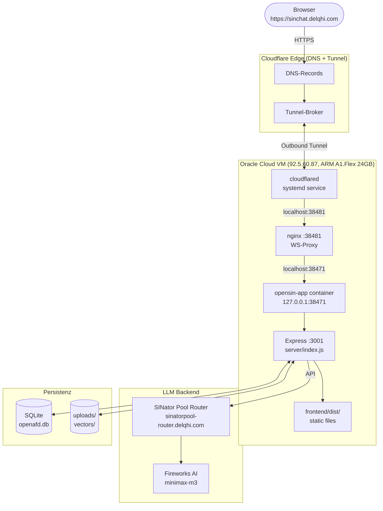

# Production-Architektur

> **Single source of truth** für „wo läuft sinchat.delqhi.com eigentlich?".
> Wenn du (oder ein Agent) wissen willst, wie die Live-Deployment-Topologie aussieht — lies dieses Doc zuerst.

**Live-URL:** https://sinchat.delqhi.com
**Letzte Aktualisierung:** 2026-06-29
**Owner:** Delqhi (Jeremy Schulze)

---

## TL;DR

```
Internet → Cloudflare DNS → Cloudflare-Tunnel-Broker
                                ↓ outbound
                          cloudflared (Oracle Cloud VM)
                                ↓ localhost:38471 (nginx)
                                ↓ localhost:3001
                            Express (server/index.js)
                                ├── /        → HTML (IndexPage.generate)
                                ├── /api/*   → JSON-API
                                ├── /static  → frontend/dist/
                                └── LLM      → SINator Pool Router → Fireworks AI
                                            ↓
                              SQLite + Vektor-Indizes + Uploads
                                    (lokal auf Oracle VM)
```

**Oracle Cloud VM IST der Produktions-Server.** Cloudflare ist nur ein sicherer Entry-Point ohne offene Ports. Kein Vercel, kein Cloudflare-Pages, kein AWS/GCP — alles auf der OCI Free-Tier VM. Watchdog-Timer und DB-Backups sind automatisiert.

---

## 1. Production-Flow



| # | Schicht | Wo | Was |
|---|---|---|---|
| 1 | Browser | Welt | HTTPS-Request auf `sinchat.delqhi.com` |
| 2 | Cloudflare DNS | Cloudflare-Edge | Löst Domain zum Tunnel-Broker auf |
| 3 | Cloudflare Tunnel | Cloudflare-Edge | Leitet HTTPS an `cloudflared` weiter (outbound) |
| 4 | `cloudflared` | Oracle VM (systemd) | Hält Outbound-Tunnel offen, leitet an nginx weiter |
| 5 | nginx | Oracle VM (`:38481`) | Reverse Proxy mit WebSocket-Upgrade-Headern |
| 6 | Docker Container | Oracle VM (`127.0.0.1:38471`) | `opensin-app` Container, Express `:3001` |
| 7 | Express | Container | HTML, API, Static Files |
| 8 | LLM | External | Express → SINator Pool Router → Fireworks AI (minimax-m3) |
| 9 | Persistenz | Container | SQLite + Vektor-Indizes + Uploads |

**Oracle Cloud VM ist der Produktions-Server.** Cloudflare ist nur ein sicherer Entry-Point ohne offene Ports. Watchdog-Timer und DB-Backups sind automatisiert.

---

## 2. Komponenten

### 2.1 Cloudflare (DNS + Tunnel)

**Rolle:** Domain-Resolution + sicherer Entry-Point mit HSTS, HTTPS-Terminierung, DDoS-Schutz.

**Security Headers (Cloudflare Edge):**
- HSTS mit preload
- HTTPS-Redirect (301)
- X-Frame-Options: DENY
- X-Content-Type-Options: nosniff
- Referrer-Policy: strict-origin-when-cross-origin

### 2.2 `cloudflared` (Tunnel-Client)

**Rolle:** Outbound-Tunnel von der Oracle VM zum Cloudflare-Broker.

**Betrieb:**
- systemd service: `cloudflared-opensin-chat.service`
- Config: `/home/ubuntu/.cloudflared/config-opensin.yml`
- Watchdog-Timer: `cloudflared-watchdog` (60s Intervall)
- Healthcheck-Timer: `sinchat-healthcheck` (120s)
- External Monitor: `sinchat-external-monitor` (300s)

### 2.3 nginx Reverse Proxy

**Rolle:** WebSocket-Upgrade-Header-Injection + Upload-Size-Limit zwischen Cloudflare Tunnel und Docker-Container.

**Config:**
- `/etc/nginx/sites-available/opensin-ws-proxy` (siehe `docker/nginx/opensin-ws-proxy.conf` im Repo)
- `/etc/nginx/conf.d/ws-upgrade.conf`
- Lauscht auf `:38481`, weiterleitung an `127.0.0.1:38471`

**WICHTIG — Upload-Limit:** nginx default `client_max_body_size` ist **1MB**. Ohne explizite Konfiguration werden PDF-Uploads >1MB bei ~72% abgebrochen (XHR stallt). Die Config setzt `client_max_body_size 256m` um multer's 200MB-Limit zu matchen.

**Deploy:**
```bash
sudo cp docker/nginx/opensin-ws-proxy.conf /etc/nginx/sites-available/opensin-ws-proxy
sudo ln -sf /etc/nginx/sites-available/opensin-ws-proxy /etc/nginx/sites-enabled/opensin-ws-proxy
sudo nginx -t && sudo systemctl reload nginx
```

**Known Issue:** Cloudflare strippt `Connection: Upgrade` / `Upgrade: websocket` Header. nginx WS-Proxy hinzugefügt, aber Cloudflare Edge beendet WebSocket weiterhin. SSE-Fallback oder Cloudflare Dashboard WebSocket-Konfig noetig.

### 2.4 Docker Container (`opensin-app`)

**Rolle:** Isolierte Runtime fuer Express-Server + Frontend + SQLite.

**Config:**
- Container-Name: `opensin-app`
- Port-Binding: `127.0.0.1:38471` (nicht oeffentlich)
- Express lauscht intern auf `:3001`
- DB: `server/storage/openafd.db` (SQLite, Permissions 640)
- Storage-Dirs: `chown 1000:1000` fuer Container-Schreibzugriff

**Wichtig:** `.env` Aenderungen erfordern `docker compose down && docker compose up -d` (NICHT `docker restart`).

### 2.5 LLM Provider (Fireworks AI)

**Architektur-Flow:**

```
User Chat Request
  -> Express Server (:3001)
  -> Agent Flow (aibitat provider system)
  -> fireworksai.js provider
     -> FIREWORKS_AI_LLM_BASE_PATH env var
     -> FIREWORKS_AI_LLM_MODEL_PREF env var
     -> User-Agent: OpenSIN-Chat/1.0 (custom header)
  -> SINator Pool Router (sinatorpool-router.delqhi.com/inference/v1)
  -> Fireworks AI Backend (accounts/fireworks/models/minimax-m3)
  -> Response streamed back to frontend
```

**Provider-Datei:** `server/utils/agents/aibitat/providers/fireworksai.js`
- Basis: OpenAI SDK mit angepasster Base URL
- Custom User-Agent noetig (SINator Pool Router blockiert Standard OpenAI SDK User-Agent)
- Env-Vars: `FIREWORKS_AI_LLM_BASE_PATH`, `FIREWORKS_AI_LLM_API_KEY`, `FIREWORKS_AI_LLM_MODEL_PREF`

### 2.6 Frontend-Bundle

**Rolle:** Statischer React/Vite/TypeScript-Build, im Container unter `frontend/dist/` abgelegt.

**Deploy-Process:**
```bash
# Lokal bauen
cd frontend && yarn build

# rsync zur VM
rsync -avz --delete frontend/dist/ ubuntu@92.5.60.87:/tmp/opensin-dist/

# In Container kopieren
ssh ubuntu@92.5.60.87 "docker cp /tmp/opensin-dist/. opensin-app:/app/frontend/dist/"

# index.html restaurieren (docker cp ueberschreibt sie)
ssh ubuntu@92.5.60.87 "docker exec opensin-app cp /app/frontend/dist/_index.html /app/frontend/dist/index.html"
```

### 2.7 Persistenz

**SQLite (`server/storage/openafd.db`):**
- Prisma-Schema in `server/prisma/schema.prisma`
- User, Workspaces, Threads, Chats, `workspace_notes`
- WAL-Mode fuer Concurrency
- Permissions: 640

**`workspace_notes` Tabelle (via raw SQL):**
```sql
CREATE TABLE workspace_notes (
    id TEXT PRIMARY KEY,
    workspace_id TEXT NOT NULL,
    title TEXT,
    content TEXT,
    pinned INTEGER DEFAULT 0,
    created_at INTEGER,
    updated_at INTEGER
);
```
Erstellt via raw SQL, nicht via Prisma-Migration (Container hat Prisma 7.8.0, Projekt 5.3.1 — `prisma migrate` schlaegt fehl).

**Vektor-Indizes (`server/storage/vectors/`):**
- LanceDB default
- Pro Workspace ein Sub-Verzeichnis

**User-Uploads (`server/storage/uploads/`):**
- Original-Files (PDF, DOCX, etc.)
- Werden NIE geloescht

### 2.5 Frontend-Bundle (`frontend/dist` → `server/public`)

**Rolle:** Statischer React/Vite-Build, der vor dem Express-Start in `server/public/` kopiert wird. Wird vom Express-Server via `express.static()` ausgeliefert.

**Build-Befehl:**

```bash
cd /Users/jeremy/dev/OpenSIN-Chat/frontend
yarn install
yarn build
# Output: frontend/dist/
```

**Verzeichnis-Layout nach Build:**

```
server/public/
├── index.html          # vom Express als "/" gerendert (überschrieben mit IndexPage.generate)
├── assets/
│   ├── index-abc123.js
│   ├── index-def456.css
│   └── ...
└── ...                 # andere statische Files
```

**Wichtig:** Die `index.html` in `server/public/` wird vom Express IGNORIERT, weil `IndexPage.generate(response)` die HTML dynamisch baut. Das spart einen Roundtrip und erlaubt es, ENV-Variablen (z.B. `VITE_API_BASE`) direkt ins HTML zu injizieren.

### 2.6 Persistenz

**SQLite (`server/storage/openafd.db`):**
- Prisma-Schema in `server/prisma/schema.prisma`
- User, Workspaces, Threads, Chats, etc.
- WAL-Mode für Concurrency

**Vektor-Indizes (`server/storage/vectors/`):**
- LanceDB default (siehe `server/utils/vectorDbProviders/lance/`)
- Auch: Chroma, Pinecone, Qdrant, Milvus, PGVector verfügbar
- Pro Workspace ein Sub-Verzeichnis

**User-Uploads (`server/storage/uploads/`):**
- Original-Files (PDF, DOCX, etc.)
- Werden NIE gelöscht — User-Daten sind heilig

**Wichtig:** Alles auf dem Mac. Keine Cloud-Persistenz. Wenn der Mac stirbt, sind alle Daten weg (außer du machst Backups — siehe unten).

---

## 3. UI-Komponenten-Hierarchie

```
App
+-- Sidebar
|   +-- ActiveWorkspaces (workspace list)
|   +-- ThreadContainer (thread list + "Neuer Chat" sticky button)
|   +-- Settings/Design toggle buttons
+-- ChatContainer
|   +-- EmptyState (4 capability cards: Quellen, Notizen, Politiker-DB, KI)
|   +-- ChatHistory (Virtuoso virtual list)
|   |   +-- HistoricalMessage
|   |       +-- Markdown renderer (code blocks, inline code, blockquote)
|   |       +-- GroundingBadge (Sparkle icon, shows model + RAG)
|   |       +-- Actions (hover-only: TTS, Copy, Edit, Good, More)
|   |           +-- RenderMetrics (hidden by default)
|   +-- PromptInput (rounded-2xl, border-white/10)
|   |   +-- TextArea (pt-3.5)
|   +-- NotepadSidebar (right sidebar, CRUD notes)
+-- modals (Settings, Documents upload)
```

**Key Design Decisions:**
- **Centered chat layout**: max-w-[800px] mx-auto (matches ChatGPT 768px, Claude 736px, Gemini 768px)
- **Light/Dark mode**: CSS `light:` prefix system, `html class="light"` or `class=""` for dark
- **Action buttons**: hover-only via `md:group-hover:opacity-100` (like ChatGPT/Claude)
- **Metrics**: hidden by default, `getAutoShowMetrics()` returns false
- **EmptyState**: shows in ALL new chats (not just workspace home)
- **Sticky sidebar buttons**: `sticky bottom-0` for Neuer Chat / Neuer Ordner
- **User bubbles**: right-aligned, bg-zinc-700 (dark) / bg-slate-100 (light), max-w-80%
- **AI messages**: left-aligned, no bubble, max-w-85%

---

## 4. WebSocket Proxy Chain

```
Frontend (browser)
  -> Cloudflare Tunnel (HTTPS/WSS)
  -> nginx reverse proxy (port 38481, ws-upgrade headers)
  -> Express Server (port 3001, ws module)
  -> Agent WebSocket (agentWebsocket.js)
```

**Known Issue:** Cloudflare strippt `Connection: Upgrade` / `Upgrade: websocket` Header. nginx WS-Proxy hinzugefuegt, aber Cloudflare Edge beendet Verbindung weiterhin. SSE-Fallback oder Cloudflare Dashboard WebSocket-Konfiguration noetig.

---

## 5. Netzwerk-Topologie

### Ports

| Port | Service | Oeffentlich? |
|------|---------|-------------|
| `:38471` | Docker Container (Express :3001) | Nein (127.0.0.1 only) |
| `:38481` | nginx Reverse Proxy | Nein (localhost only) |
| `:443` | Cloudflare Tunnel (outbound) | Ja (via Cloudflare Edge) |

**Kein offener Port auf der VM.** Cloudflare Tunnel funktioniert outbound — `cloudflared` initiiert die Verbindung.

### Production-Infrastruktur

```
Oracle Cloud VM (92.5.60.87, ARM A1.Flex 24GB)
+-- opensin-app container (127.0.0.1:38471)
|   +-- Express Server (:3001)
|   +-- Frontend (static dist/)
|   +-- SQLite DB (server/storage/openafd.db)
+-- nginx reverse proxy (:38481)
+-- cloudflared tunnel (systemd)
+-- Watchdog timers:
|   +-- cloudflared-watchdog (60s)
|   +-- sinchat-healthcheck (120s)
|   +-- sinchat-external-monitor (300s)
+-- DB backups (cron daily 03:00 -> /home/ubuntu/backups/)
+-- Uptime Kuma (status.delqhi.com)
```

---

## 6. Operations-Runbook

### 6.1 Tägliche Checks

```bash
# cloudflared service
sudo systemctl status cloudflared-opensin-chat

# Container
ssh ubuntu@92.5.60.87 "docker ps | grep opensin-app"

# Live-URL
curl -sI https://sinchat.delqhi.com

# Uptime Kuma
curl -sI https://status.delqhi.com
```

### 6.2 Nach Frontend-Aenderungen

```bash
cd frontend && yarn build
rsync -avz --delete frontend/dist/ ubuntu@92.5.60.87:/tmp/opensin-dist/
ssh ubuntu@92.5.60.87 "docker cp /tmp/opensin-dist/. opensin-app:/app/frontend/dist/"
ssh ubuntu@92.5.60.87 "docker exec opensin-app cp /app/frontend/dist/_index.html /app/frontend/dist/index.html"
```

### 6.3 Nach Server-Aenderungen

```bash
# .env geaendert -> full restart noetig
ssh ubuntu@92.5.60.87 "cd /home/ubuntu/OpenSIN-Chat && docker compose down && docker compose up -d"
# NICHT: docker restart (laedt .env nicht neu)
```

### 6.4 Wenn die App offline ist

1. **VM laeuft?** `ssh ubuntu@92.5.60.87`
2. **cloudflared service?** `sudo systemctl status cloudflared-opensin-chat`
3. **Container laeuft?** `docker ps | grep opensin-app`
4. **Healthcheck:** `curl http://localhost:38471/api/ping`
5. **Cloudflare-Status:** https://www.cloudflarestatus.com/

### 6.5 Backups

- **Automatisiert:** Cron-Job taeglich 03:00 -> `/home/ubuntu/backups/`
- **Format:** SQLite DB dump
- **Verifizierung:** TODO — Test-Restore nicht implementiert (P3)

---

## 7. Was NICHT zur Production-Architektur gehört

| Was | Warum NICHT |
|---|---|
| **Vercel** | GitHub App macht Preview-Builds. Hat NULL mit Production zu tun. |
| **Cloudflare Pages** | Kein Pages-Deployment. Cloudflare ist nur DNS + Tunnel. |
| **`cloud-deployments/`** | Historisch aus Upstream-Fork. Nicht in Verwendung. |
| **Collector (`:8888`)** | In Docker-Setup im gleichen Container, nicht als separater Prozess. |

---

## 8. Verwandte Docs

- [`README.md`](../README.md) — Projekt-Uebersicht, Features, Quickstart
- [`DEPLOYMENT_GUIDE.md`](../DEPLOYMENT_GUIDE.md) — Deployment-Anleitung (Ports, Fireworks AI, Cloudflare Tunnel)
- [`SECURITY.md`](../SECURITY.md) — Auth, API-Key-Handling, Port-Binding
- [`CONTRIBUTING.md`](../CONTRIBUTING.md) — Dev-Setup, yarn, OrbStack, Brand-Regeln

---

## 9. Architektur-Entscheidungen (ADRs)

### ADR-001: Oracle Cloud VM als Produktions-Host

**Status:** Aktiv (ersetzt urspruengliches Mac-Setup)
**Datum:** Seit ~April 2026
**Kontext:** OpenSIN-Chat ist ein Single-User-POC mit privater Nutzung.

**Entscheidung:** Oracle Cloud VM (ARM A1.Flex 24GB, Free-Tier) als Produktions-Server. Cloudflare-Tunnel fuer sicheren Public-Access. Docker Container fuer Isolierung.

**Konsequenzen:**
- Keine Cloud-Kosten (OCI Free-Tier)
- Volle Datenkontrolle (DSGVO)
- 24/7 Uptime (VM schlaeft nicht, anders als Mac)
- Watchdog-Timer + Healthchecks automatisiert
- DB-Backups taeglich 03:00

### ADR-002: Cloudflare Tunnel statt Port-Forwarding

**Status:** Aktiv
**Kontext:** VM braucht HTTPS mit echtem Zertifikat, keine offenen Ports.

**Entscheidung:** Cloudflare-Tunnel (outbound) statt Port-Forwarding.

**Konsequenzen:**
- Funktioniert hinter NAT/Firewall
- Kostenlos (Free-Tier)
- HTTPS mit echtem Zertifikat out-of-the-box
- DDoS-Schutz gratis
- HSTS preload aktiviert
- Known Issue: WebSocket Upgrade-Header werden von Cloudflare gestrippt

### ADR-003: Docker Container fuer Production

**Status:** Aktiv
**Kontext:** Express-Server, Frontend und SQLite in isolierter Umgebung.

**Entscheidung:** Docker Container (`opensin-app`), Port-Binding an `127.0.0.1:38471`.

**Konsequenzen:**
- Isolierte Runtime
- Keine offenen Ports (nur localhost)
- `.env` Aenderungen erfordern `docker compose down && up`
- Storage-Dirs muessen `1000:1000` sein

### ADR-004: Fireworks AI als primärer LLM-Provider

**Status:** Aktiv
**Datum:** Seit ~Juni 2026
**Kontext:** Migration von Ollama/ lokalen Modellen zu gehostetem LLM.

**Entscheidung:** Fireworks AI via SINator Pool Router als primärer Provider. Model: `accounts/fireworks/models/minimax-m3`.

**Konsequenzen:**
- Custom `fireworksai.js` Provider mit env-var Base URL
- Custom User-Agent: `OpenSIN-Chat/1.0` (Pool Router blockiert Standard)
- Keine lokale GPU noetig
- Kosten variieren nach Modell
